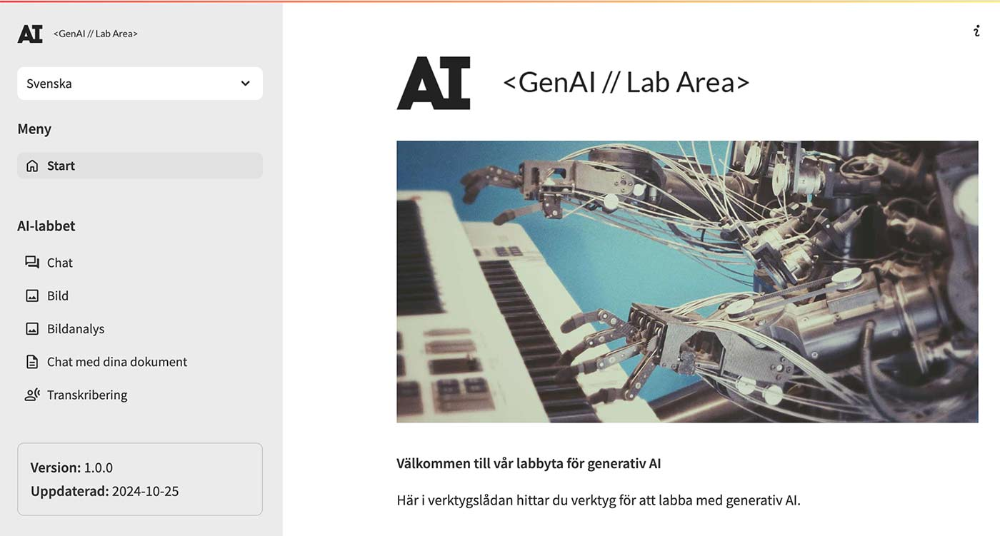
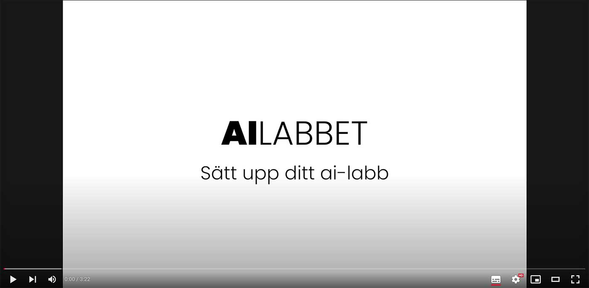

# GenAI // Labbyta

### Vad?
Det här är en labbyta som du snabbt kan sätta upp lokalt eller exempelvis på [Streamlit](https://streamlit.io/), för att låta användare prova generativa AI-verktyg utan att behöva skapa egna konton.  
Det enda som behövs är en API-nyckel från OpenAI.  
Den här labbytan är en del av den utbildningsmiljö som jag använder och sätter upp inför exempelvis 
workshops, kurser, masterclasses och annat.




### AI-verktyg?
Just nu finns det följande verktyg:
- Chat | Chatta med en språkmodell, som GPT-4o från OpenAI eller om du har API från Groq även LLama
- Bild | Generera bilder med DALL-E 3 från OpenAI
- Bildanalys | Analysera bilder med GPT-4o från OpenAI
- Chat med dokument | Enkel [RAG](https://en.wikipedia.org/wiki/Retrieval-augmented_generation) för att kunna ladda upp ett eller flera dokument som du kan chatta med. Använder embeddings-model från OpenAI
- Transkribering | Spela in din röst direkt via webbläsaren eller ladda upp ljudfil, så får du den transkriberad till text med Whisper från OpenAI

Du kan tänka på labbet som ett uppstyckat ChatGPT, där de olika delarna är uppdelade i separata tjänster.

## Installation

### Du behöver
Miljön är kodad i Python med öppen mjukvara, så det finns inga kostnader kopplat till det. Konto på GitHub och Streamlit är också kostnadsfritt.  
Dock behöver du en API-nyckel från OpenAI för att kunna använda deras tjänster. API-nyckeln har 
ingenting att göra med ChatGPT, utan är helt separat. Gällande betalning, så sätter man in pengar 
i förväg och kostnad beräknas på användande. Tar pengarna slut, så slutar tjänsten att fungera.  

- API-nyckel skaffar du på [platform.openai.com](https://platform.openai.com/)
- Konto på  GitHub - För att kunna skapa en kopia av koden om du vill köra den online på Streamlit
- Konto på Streamlit  - Här kommer du att drifta din labbyta

### Installation på Streamlit
I filmen nedan ser du hur installationen går till. I texten under filmen finns alla länkar och övrig information som du behöver. Så använd både film och text.

[](https://youtu.be/ETlXWefccUw)

1. Skapa konto på [GitHub](https://github.com/)
2. Skapa konto på Streamlit - [share.streamlit.io](https://share.streamlit.io/) - genom att logga in med ditt GitHub-konto. Då kopplas dina konton ihop automatiskt.
3. Gå till https://github.com/mickekring/gen-ai-labb och klicka på "Fork", så klonas koden till din GitHub.
4. Gå till [share.streamlit.io](https://share.streamlit.io/) och klicka på "Create App"
5. Välj "Deploy from a public app from GitHub"
6. I "Repository", välj den som heter "gen-ai-lab".
7. "Branch" ska stå på "main".
8. I "Main file path" väljer du "Start.py"
9. Vid "App URL" väljer du det domännamn du vill ha till din app, som exempelvis "mittlabb". Då blir adressen mittlabb.streamlit.app 
10. Klicka på "Advanced settings" och klistra in nedanstående. Inom citationstecknen så klistrar du in din API-nyckel till OpenAI och istället för "password123" så sätter du ett eget lösenord för att komma åt appen. Om du ändrar "pwd_on" till false så krävs inget lösenord för att komma åt appen.
```
openai_key = ""  
pwd_on = "true"  
password = "password123"  
```
11. Klicka till sist på "Deploy" och vänta tills Streamlit bakat klart din app. Sen är det bara att köra.

### Lokal installation
Om du vill installera labbytan lokalt, så får du klona koden till din hårddisk och köra installation av requirements.txt.  
Rekommenderat är att du sätter upp en virtuel mijö med venv. 
Därefter måste du skapa filen /.streamlit/secrets.toml där du lägger in hemligheterna på samma sätt som ovan 
```
openai_key = ""  
pwd_on = "true"  
password = "password123"  
```

Sedan kör du igång appen med
```
streamlit run Start.py
```

### Uppdateringar
I takt med att jag uppdaterar koden, så kan du uppdatera din app genom att
1. Gå till din GitHub-sida.
2. Klicka på "Sync fork" om det finns några uppdateringar och klicka på "Update branch".
3. Gå till [share.streamlit.io](https://share.streamlit.io/) och klicka på de tre prickarna till höger om din app och välj "Reboot". Då bakas din app om och när det är klart så är din app uppdaterad.

## Vad får jag göra med koden?
Du är fri att använda den, modifiera och göra vad du vill med den. I image-mappen finns även photoshopdokumenten för logotyperna.  
Du får också ha lite förbarmande av att koden kan vara av sisådär karaktär. Jag är bara en hobbykodare. 

## Säkerhet / GDPR
Det här är en labbyta som använder amerikanska tjänster, så tänk på vad du stoppar in i den. 

## Tips!
- Om du inte ser några bilder när du genererat en bild, utan en ikon som ser ut som en trasig bild, kolla att du inte har någon 'ad-blocker' i din webbläsare.
  I vissa fall så tror dessa 'ad-blockers' att bilden du genererat är reklam. Testa även en annan webbläsare för säkerhets skull.

## Buggar
- Inget rapporterat ännu

